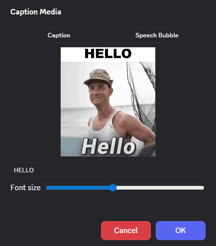
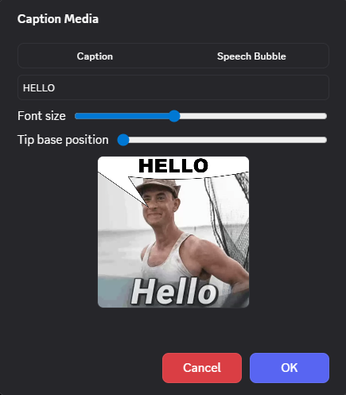

# GifCaptioner

Add captions and speech bubbles to GIFs, videos, and images, then export the result as a GIF ready to send.

## Features

- Meme-style caption mode (top white bar + text)
- Speech bubble mode (bubble, click-to-place tip, optional text)
- Live preview in the editor modal
- Automatic text wrapping (including very long words)
- Multiple entry points:
  - `CC` button in the GIF picker
  - Context menu action on image/video media
  - Attachment action button before sending
- Exports as `captioned.gif` and uploads to the current channel

## Usage

1. Open a media item (GIF, image, or video) from any supported entry point.
2. Choose `Caption` or `Speech Bubble`.
3. Edit text and font size (and bubble tip position if needed).
4. Click `OK` to start rendering.
5. The generated GIF is ready to send.

## Known limitations

- Long videos can take time to render.
- Some external video hosts can be blocked by Discord CSP.
- Output is converted to GIF, so final quality and file size depend on the source.

