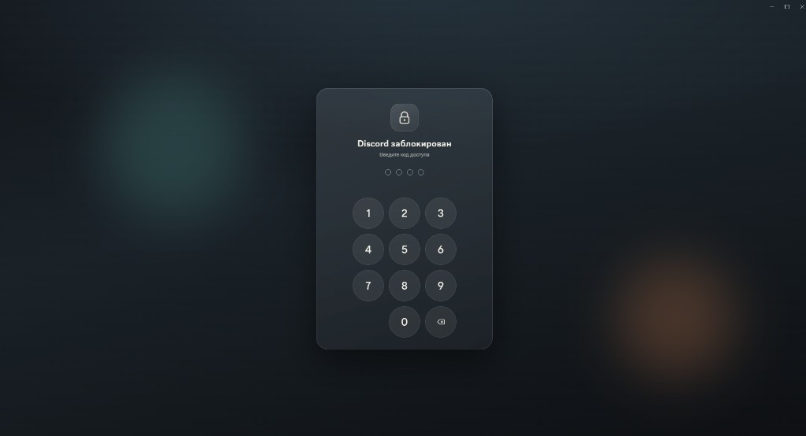

# PasscodeLock

Locks Discord behind a numeric passcode when you step away.

Inspired by BetterDiscord [PasscodeLock](https://betterdiscord.app/plugin/PasscodeLock).

## Preview

## Features

- Set a 4 or 6 digit passcode (stored as PBKDF2 hash)
- Lock on startup / restore last lock state
- Auto-lock after the window loses focus
- Skips locking while you are in a voice channel
- `/lock` command and settings buttons
- English / Russian UI

## Usage

1. Enable the plugin
2. Set a passcode from the plugin settings
3. Use **Lock now**, `/lock`, or wait for auto-lock
