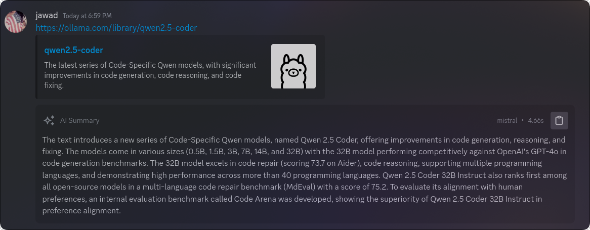

# LinkSummarizer

Adds a button to summarize links in messages using Ollama.



## Setup Instructions

1. Download and install Ollama from [ollama.ai](https://ollama.ai)

2. Install and run a model using the terminal:

    ```bash
    ollama run mistral
    ```

    > You can change the model in plugin settings.

## Usage

1. Hover over any message containing a link
2. Click the ✨ icon

## Settings

-   `Ollama Host`: The URL of your Ollama instance
-   `Ollama Model`: The Ollama model to use
-   `Max Tokens`: The maximum number of tokens in the summary
-   `Temperature`: The temperature for text generation

## Requirements

-   Vencord installed
-   Ollama installed and running locally
-   An Ollama model downloaded and available

## Known Limitations

-   Some websites may block access to their content
-   Summary quality depends on the chosen Ollama model

## Contributing

Feel free to contribute to this plugin by:

-   Reporting bugs
-   Suggesting improvements
-   Submitting pull requests
