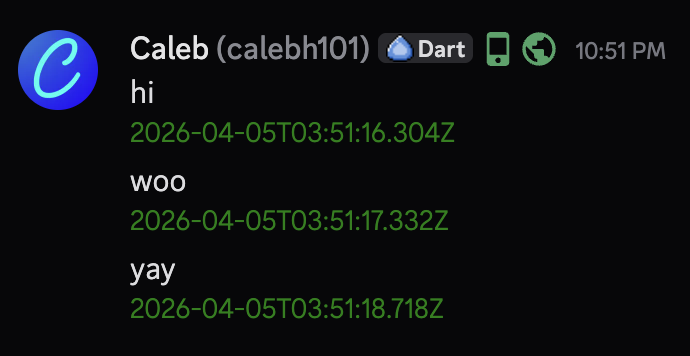

# About

This plugin is very simple; it reorders messages based on their timestamps. This might *seem* useless, but it's really not. (in my humble opinion)

Basically, I've found that the client's message store just kinda receives a message, whether from itself, or from the server, and just accepts it. But this creates some inconsistencies; if you and someone else send a message at around the same time, at least one of the clients will show a different order than the server received it.

This plugin basically uses the timestamps of each message, and sorts them how they should be. Each message's timestamp represents when the server received it, *not* the client.

# Settings

### Show Message Timestamps

Really a debug feature, this shows colored timestamps like the below image. This made it easy to see if the plugin was working or not.

# FAQ

**1. Every once in a while, it doesn't reorder until it re-renders, like when another message is received.**

Yeah, that just happens every once in a while. Discord be Discord. It doesn't happen nearly enough times to justify finding a fix for it though.

---

By [Calebh101](https://github.com/Calebh101) 
Repo: [Calebh101/VC-MessageCorrector](https://github.com/Calebh101/VC-MessageCorrector)
