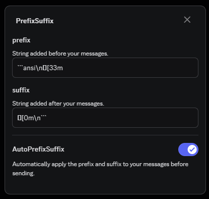

> ## PrefixSuffix
> A Vencord plugin to add any prefix and suffix to your messages :3

This can be use for simple things like automatically adding "-# " to your messages so they show as subtext:

```
prefix > "-# "
suffix > ""
```


Or for really complex and annoying things to type, like ansi codes. Discord has some ansi code support, so say you wanted to talk using the color yellow, you can do this by using this settings:

```
prefix > "```ansi\n"
suffix > "\n```"
```




> ℹ️ [ being U+001B](https://unicode-explorer.com/c/001B)