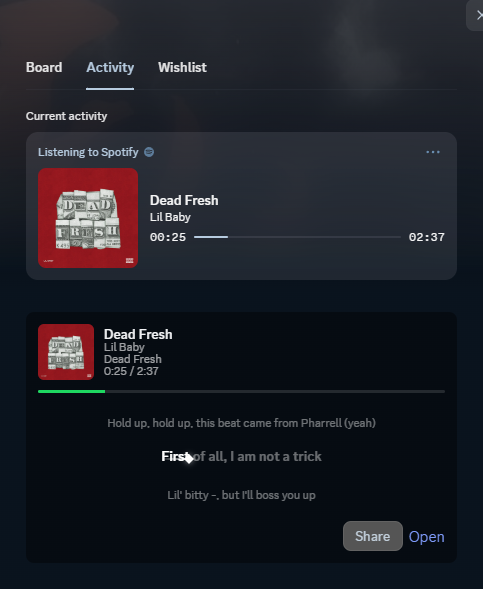
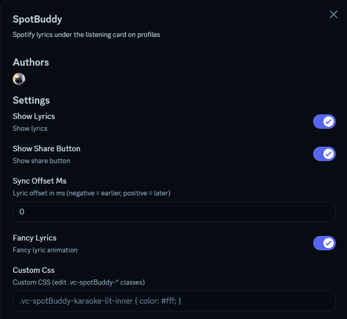
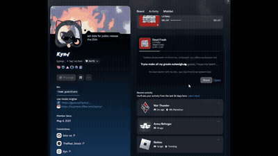

# SpotBuddy

Spotify lyrics under the listening card on profiles.

Shows the current track and synced lyrics (via [lrclib](https://lrclib.net)) on your profile and on other people when they have Spotify activity.

Injected with Discord React patches (profile popout / modal / activity card), not DOM scanning.

## Preview

## Settings

- **Show Lyrics** – toggle lyric panel
- **Show Share Button** – share / open buttons
- **Sync Offset Ms** – nudge lyrics earlier/later
- **Fancy Lyrics** – karaoke wipe + star
- **Custom Css** – style `.vc-spotBuddy-*` classes

## Notes

- Works best on your own account (Spotify connected in Discord)
- Other users need Spotify activity visible
- Desktop / Vesktop (uses `native.ts` for lrclib fetch + CSP)
