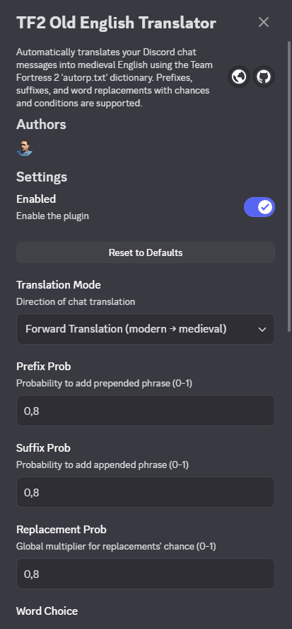
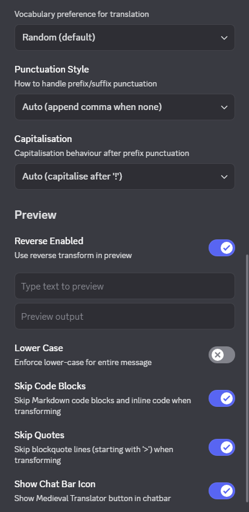
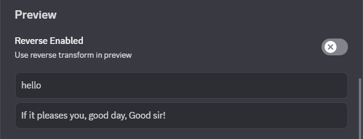
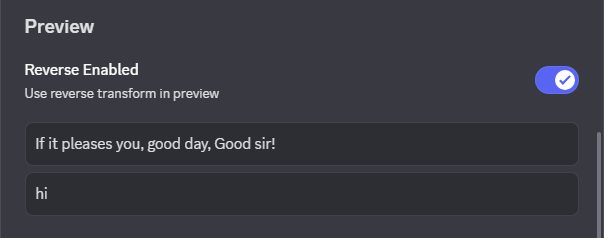

# TF2 | 𝔒𝔩𝔡 𝔈𝔫𝔤𝔩𝔦𝔰𝔥 𝔗𝔯𝔞𝔫𝔰𝔩𝔞𝔱𝔬𝔯

Automatically translates your Discord chat messages into medieval/Renaissance English (or pirate-ish, depending on the replacements) using the Team Fortress 2 `autorp.txt` dictionary.

## Features

-   **Prefixes**: Randomly adds phrases like \"Forsooth, \" or \"Hark! \" with configurable probability of occurrence.
-   **Word replacements**: Substitutes modern words with archaic equivalents, e.g., \"you\" → \"thou\", \"hello\" → \"well met\"; class names like \"demoman\" → \"swordsman\" with configurable probability and preference of length of replacement phrases.
-   **Conditional rules**: Respects `prev` words, plurals, chances, and adjective prepends (e.g., insults get random adjectives).
-   **Suffixes**: Adds endings like \"Anon!\" or \"Good sir!\" with configurable probability.
-   **Punctuation handling**: Deals case-insensitively with replacement words, while keeping punctuation.
-   **Placeholders**: Expands `&god`, `&godadj` etc. variables randomly.
-   **Markdown support** (experimental): Tries to preserve Markdown formatting tags (like **bold**, _cursive_) without interference, as well as original content of Quote and Code blocks, if you wish so.
-   **Reverse translation** (experimental): Translates the ancient phrases back into modern common speech. (note: due to dozen of word variants and synonymous, it may be hard to achieve the source sentence exactly)
-   **Preview**: Allows to play around and test individual settings in the plugin's settings, featuring toggle for reversing the direction of translation, independent from the main settings.
-   **Chat Bar Icon**: A visual indicator and quick-settings toggle, intergrated directly into Discord chat input field. Right-click to toggle between Forward, Reverse and Disabled states; left-click to open full plugin's settings.

## Usage

1. Enable the plugin in Vencord settings.
2. Adjust probabilities and other settings as needed.
3. Type messages as you are used to — they get auto-translated before sending.
4. Quickly pause all translations by right-clicking plugin's icon in the Chat Input. Mode is indicated by colour:
    - **Green**: Enabled translation to medieval English
    - **AsterBlue**: Enabled reverse translation, back into modern English
    - **Grey**: Disabled, all chat translations paused

If you need to quickly change some advanced settings, just left-click the icon. Or, you can hide the icon completely, if you prefer interface minimalism.
If you've messed with the settings too much, you can always head back to the plugin's settings and reset them to defaults.

## Example

Input: `hello idiot, kill the sniper!`

Possible Output: `Well met, base-court fawning clotpole, slay the archer! Zounds!`

## Screenshots

### Settings

### Preview (in-settings)

### Chat Bar Icon (Mode Toggle)

![Chat Bar Icon (Mode Toggle) [APNG]](./img/tfMedievel_chatbar_icon.png)

## Credits

VALVᴱ and Team Fortress 2 team for creating `AutoRP.txt` containing the unique ruleset and dictionary, on which is this plugin based on.
