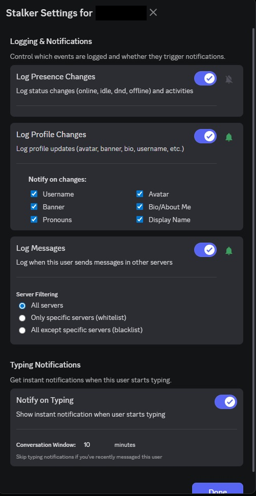
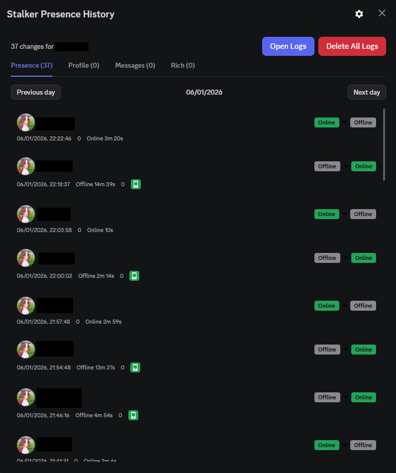
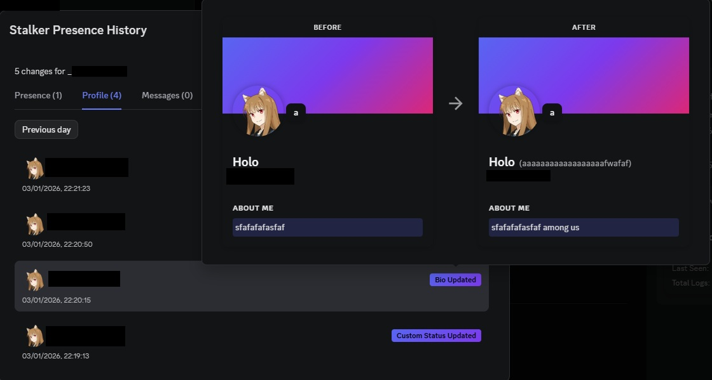
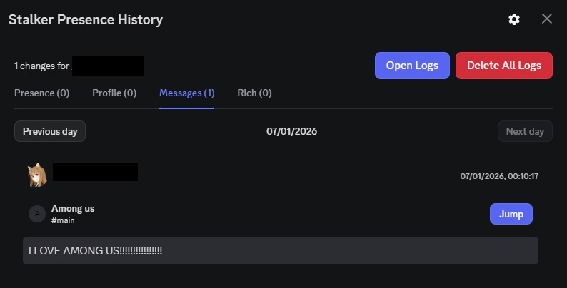

# Vencord Stalker

A Vencord custom plugin that logs presence/activity changes and user profile updates for selected users.

## Features

- Presence + status change logging
- Activity / rich presence logging
- Profile change logging (avatar, banner, username/display name, bio, pronouns, custom status)
- Optional message + typing notifications
- Per-user settings
- Local history + log retention

## Installation

Read the Vencord custom plugins guide:
https://docs.vencord.dev/installing/custom-plugins/

Or follow this video:
https://youtu.be/XmVNRKrphlw?si=XFwjkwU_1bMOjOUc

## Usage

- Right-click a user → **Stalk User**
- Open the plugin settings to configure what gets logged/notified

## Screenshots

