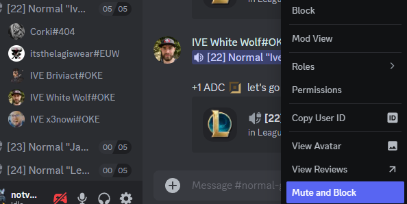
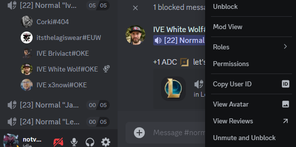

# Voice Mute Blocked Users

The **Voice Mute Blocked Users** plugin automatically mutes users that you have blocked on Discord, enhancing visibility and manageability in your communication environment. This plugin transforms normal blocks into effective voice mutes, ensuring a smoother experience.

## Functionality

-   **Block/Unblock Logic**:

    -   When a user is blocked, they are automatically muted if not already muted.
    -   When a user is unblocked, they are unmuted if they were previously muted.

-   **User Context Menu**:
    -   Adds a menu item to mute/unmute users directly from their context menu.

Before:

After:

